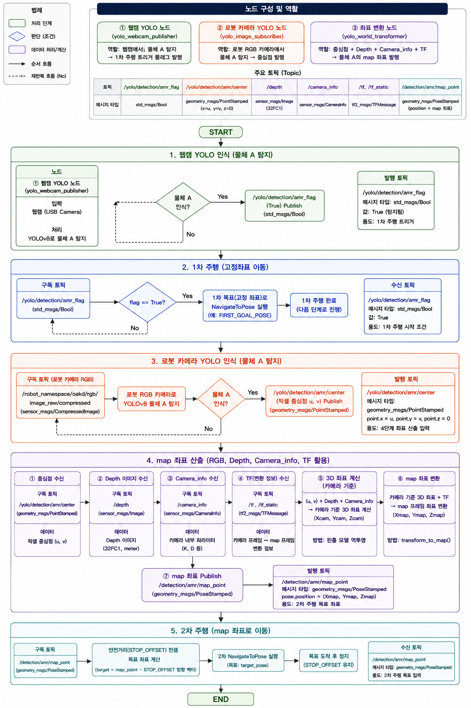

# TurtleBot4 YOLO 기반 물체 탐지·자율주행 미니 프로젝트

웹캠으로 대상 물체(RC-Car)를 탐지하면 TurtleBot4가 1차 고정 좌표로 자율주행하고,
도착 지점에서 로봇의 OAK-D 카메라로 물체를 다시 탐지한 뒤
**RGB 픽셀 좌표 + Depth + Camera Info + TF** 를 이용해 물체의 실제 `map` 좌표를 계산,
그 좌표로 2차 자율주행하여 안전거리에서 정지·정렬하는 시스템입니다.

---

## 1. 주요 기능

| # | 기능 | 설명 |
|---|------|------|
| 1 | **웹캠 YOLO 탐지 (1차 트리거)** | USB 웹캠 영상에서 YOLOv8로 물체(`rc-car`)를 탐지하여 `Bool` 플래그 발행 |
| 2 | **1차 자율주행 (고정 좌표)** | 플래그 수신 시 Dock → Initial Pose 설정 → Undock → 사전 정의된 접근 지점으로 `NavigateToPose` 실행 |
| 3 | **로봇 카메라 YOLO 탐지** | TurtleBot4 OAK-D RGB(Compressed) 영상에서 YOLOv8로 물체를 탐지하고 bbox **중심 픽셀 좌표(u, v)** 발행 |
| 4 | **3D 좌표 산출 & map 변환** | 중심점(u,v) + Depth(compressedDepth) + Camera Intrinsic(K) 로 핀홀 모델 역투영 → 카메라 기준 3D 좌표 → TF로 `map` 프레임 변환 |
| 5 | **2차 자율주행 (동적 좌표)** | 계산된 `map` 좌표를 목표로 재주행. 물체를 바라보는 방향(yaw)까지 계산해 orientation 설정 |
| 6 | **안전거리 정지 & 정렬** | Depth 거리가 `STOP_DISTANCE`(1.0 m) 이하가 되면 Nav2 목표를 취소하고 제자리에서 물체 방향으로만 회전 정렬 |
| 7 | **노이즈 보정** | 중심점 단일 픽셀이 아닌 주변 11×11 패치의 **median depth** 사용으로 Depth 튐 현상 완화 |
| 8 | **시간 동기화** | `ApproximateTimeSynchronizer`(slop 0.1s)로 RGB/Depth 프레임을 타임스탬프 기준 동기화 |
| 9 | **비프음 알림 (옵션)** | `irobot_create_msgs/AudioNoteVector`로 로봇 스피커 비프음 재생 |

---

## 2. 시스템 설계 / 플로우 차트




### 2-1. 노드 구성 및 역할

| # | 노드 | 파일 | 역할 |
|---|------|------|------|
| ① | `yolo_webcam_publisher` | [yolo_pub_wc.py](src/basic/joonwon/yolo_pub_wc.py) | 웹캠에서 물체 탐지 → **1차 주행 트리거 플래그 발행** |
| ② | `yolo_image_subscriber` | [yolo_det_compress.py](src/basic/joonwon/yolo_det_compress.py) | 로봇 RGB 카메라에서 물체 탐지 → **bbox 중심점 발행** |
| ③ | `depth_to_map_node` | [depth_to_nav_goal.py](src/basic/joonwon/depth_to_nav_goal.py) | 중심점 + Depth + CameraInfo + TF → **map 좌표 산출 및 Nav2 주행 제어** |

### 2-2. 주요 토픽

| 토픽 | 메시지 타입 | 발행 | 구독 | 용도 |
|------|-------------|------|------|------|
| `/yolo/detection/amr_flag` | `std_msgs/Bool` | ① | ③ | 1차 주행 트리거 (True = 탐지됨) |
| `/yolo/detection/web_cam` | `sensor_msgs/Image` | ① | (시각화) | 웹캠 탐지 결과 영상 |
| `/{ns}/oakd/rgb/image_raw/compressed` | `sensor_msgs/CompressedImage` | 로봇 | ②, ③ | 로봇 RGB 영상 |
| `/yolo/detection/amr/center` | `geometry_msgs/PointStamped` | ② | ③ | bbox 중심 픽셀 (x=u, y=v, z=0) |
| `/yolo/detection/amr/compressed` | `sensor_msgs/CompressedImage` | ② | (시각화) | 로봇 카메라 탐지 결과 영상 |
| `/{ns}/oakd/stereo/image_raw/compressedDepth` | `sensor_msgs/CompressedImage` | 로봇 | ③ | Depth 영상 (32FC1 / 16UC1) |
| `/{ns}/oakd/rgb/camera_info` | `sensor_msgs/CameraInfo` | 로봇 | ③ | 카메라 내부 파라미터 (K, D) |
| `/{ns}/tf`, `/{ns}/tf_static` | `tf2_msgs/TFMessage` | 로봇 | ③ | 카메라 프레임 ↔ map 프레임 변환 |
| `/{ns}/cmd_audio` | `irobot_create_msgs/AudioNoteVector` | beep | 로봇 | 비프음 재생 (옵션) |

> `{ns}`는 로봇 네임스페이스 (기본값 `robot2`).

### 2-3. 동작 시퀀스

```
START
  │
  ├─[1] 웹캠 YOLO 탐지 ──── 물체 인식? ──No──┐ (재탐지 루프)
  │                            │Yes         │
  │                            ▼            │
  │              /yolo/detection/amr_flag (True) 발행
  │                            │
  ├─[2] 1차 주행 (State: WAIT_FLAG → MOVING)
  │        Dock → setInitialPose → waitUntilNav2Active → Undock
  │        → WEST_APPROACH_POSITION 으로 startToPose()
  │                            │
  ├─[3] 로봇 카메라 YOLO 탐지 (State: DETECT, TF 안정화 5초 대기)
  │        물체 인식? ──No──┐ (재탐지 루프)
  │             │Yes        │
  │             ▼
  │        /yolo/detection/amr/center (u, v) 발행
  │                            │
  ├─[4] map 좌표 산출
  │        ① 중심점 (u, v)          ② Depth 이미지 (patch median)
  │        ③ CameraInfo (fx,fy,cx,cy) ④ TF (camera → map)
  │        ⑤ 핀홀 역투영:  X=(u-cx)·z/fx,  Y=(v-cy)·z/fy,  Z=z
  │        ⑥ tf_buffer.transform(pt_camera, 'map')
  │        ⑦ yaw = atan2(map_y - robot_y, map_x - robot_x)
  │                            │
  ├─[5] 2차 주행
  │        z > STOP_DISTANCE  → goToPose(물체 map 좌표 + yaw)  ※ 최초 1회만 전송
  │        z ≤ STOP_DISTANCE  → cancelTask() → 현재 위치에서 물체 방향으로 회전 정렬
  │                            │
END ◀───────────────────── 접근 완료 (approach_done = True)
```

### 2-4. 상태 머신 (`depth_to_nav_goal.py`)

| State | 진입 조건 | 수행 내용 |
|-------|-----------|-----------|
| `WAIT_FLAG` | 초기 상태 | `/yolo/detection/amr_flag == True` 대기 |
| `MOVING` | 플래그 수신 | 도킹 확인 → Initial Pose 설정 → Nav2 활성화 대기 → Undock → 접근 지점 주행 |
| `DETECT` | 접근 지점 도착 | TF 안정화 5초 대기 후, 중심점 수신 시마다 즉시 좌표 산출·주행 |

---

## 3. 운영체제 / 개발 환경

| 항목 | 버전 |
|------|------|
| OS | Ubuntu 22.04.5 LTS (Jammy) |
| ROS 2 | Humble Hawksbill |
| Python | 3.10.12 |
| RMW | Cyclone DDS (`rmw_cyclonedds_cpp`) |
| Navigation | Nav2 + `turtlebot4_navigation` (TurtleBot4Navigator) |
| 딥러닝 | YOLOv8 (Ultralytics 8.4.52), PyTorch 2.6.0 + CUDA 12.4 |
| 로봇 OS | TurtleBot4 (Raspberry Pi 4 / iRobot Create 3) |

---

## 4. 사용 장비 목록

| 구분 | 장비 | 비고 |
|------|------|------|
| 로봇 | **TurtleBot4 (Standard/Lite)** | iRobot Create 3 베이스 |
| SBC | Raspberry Pi 4 (4GB/8GB) | 로봇 탑재 |
| 3D 카메라 | **OAK-D Pro / OAK-D-Lite** | RGB + Stereo Depth |
| LiDAR | RPLIDAR A1M8 | SLAM / Nav2 장애물 회피 |
| 도킹 스테이션 | Create 3 Dock | Initial Pose 기준점 |
| 외부 카메라 | **USB 웹캠** (`/dev/video2`) | 1차 트리거용 |
| 원격 PC | Ubuntu 22.04 PC (NVIDIA GPU) | YOLO 추론 및 노드 실행 |
| 네트워크 | Wi-Fi AP (동일 서브넷) | 로봇 ↔ PC DDS 통신 |
| 탐지 대상 | RC-Car (클래스: `rc-car` / `Car`) | 커스텀 학습 모델 |

---

## 5. 의존성 설치

### 5-1. ROS 2 패키지 (apt)

```bash
sudo apt update
sudo apt install -y \
  ros-humble-desktop \
  ros-humble-turtlebot4-navigation \
  ros-humble-turtlebot4-msgs \
  ros-humble-irobot-create-msgs \
  ros-humble-navigation2 ros-humble-nav2-bringup \
  ros-humble-cv-bridge \
  ros-humble-vision-msgs \
  ros-humble-tf2-ros ros-humble-tf2-geometry-msgs \
  ros-humble-message-filters \
  ros-humble-image-transport-plugins \
  ros-humble-compressed-depth-image-transport \
  ros-humble-rmw-cyclonedds-cpp
```

### 5-2. Python 패키지 (pip)

```bash
pip install -r requirements.txt
```

<details>
<summary>requirements.txt 내용</summary>

```
ultralytics==8.4.52
opencv-python==4.13.0.92
numpy==1.24.4          # cv_bridge 호환을 위해 numpy 1.x 고정
torch==2.6.0
torchvision==0.21.0
```
</details>

### 5-3. 환경 변수

```bash
source /opt/ros/humble/setup.bash
export ROS_DOMAIN_ID=<로봇과 동일한 값>
export RMW_IMPLEMENTATION=rmw_cyclonedds_cpp
```

---

## 6. 실행 순서

### STEP 0. 사전 준비

```bash
# (1) 로봇 전원 ON, 도킹 상태 확인
# (2) 로봇과 PC가 동일 ROS_DOMAIN_ID / 네트워크에 있는지 확인
ros2 topic list | grep robot2

# (3) 웹캠 연결 확인 (yolo_pub_wc.py는 VideoCapture(2) 사용)
ls /dev/video*
```

### STEP 1. Nav2 / 지도 실행 (로봇 or PC)

```bash
# 터미널 1 - 지도 기반 Localization
ros2 launch turtlebot4_navigation localization.launch.py \
  namespace:=/robot2 map:=$HOME/maps/map.yaml

# 터미널 2 - Nav2
ros2 launch turtlebot4_navigation nav2.launch.py namespace:=/robot2

# 터미널 3 - RViz (시각화, 옵션)
ros2 launch turtlebot4_viz view_robot.launch.py namespace:=/robot2
```

### STEP 2. 좌표 변환 & 자율주행 노드 (③)

```bash
# 터미널 4
python3 src/basic/joonwon/depth_to_nav_goal.py
```
> `AMR 탐지 플래그 대기 중...` 로그가 출력되면 정상. 플래그 수신 전까지 대기합니다.

### STEP 3. 로봇 카메라 YOLO 노드 (②)

```bash
# 터미널 5
python3 src/basic/joonwon/yolo_det_compress.py
# → Enter path to model file (.pt): /path/to/best.pt
# → Enter robot namespace (e.g. robot2): robot2
```
> OpenCV 창(`YOLOv8 Detection`)이 뜹니다. `q` 키로 종료.

### STEP 4. 웹캠 YOLO 노드 (①) — **최종 트리거**

```bash
# 터미널 6
python3 src/basic/joonwon/yolo_pub_wc.py
# → Enter path to model file (.pt, .engine, .onnx): /path/to/best.pt
```
> 웹캠에 `rc-car`가 인식되는 순간 `/yolo/detection/amr_flag`가 `True`로 발행되고
> STEP 2의 노드가 자동으로 1차 주행을 시작합니다.

### (옵션) 비프음 노드

```bash
python3 src/basic/joonwon/beep_node.py --ros-args -p robot_name:=robot2
```

### 실행 순서 요약

```
[Nav2 / Localization]  →  [③ depth_to_nav_goal.py]  →  [② yolo_det_compress.py]  →  [① yolo_pub_wc.py]
      STEP 1                     STEP 2                        STEP 3                     STEP 4
                            (플래그 대기)                  (중심점 발행 대기)            (트리거 발생!)
```

> ③ → ② → ① 순서로 실행해야 합니다. 트리거 노드(①)를 먼저 켜면
> 구독자가 준비되기 전에 플래그가 발행되어 주행이 시작되지 않을 수 있습니다.

---

## 7. 주요 파라미터

| 파일 | 상수 | 기본값 | 설명 |
|------|------|--------|------|
| `yolo_pub_wc.py` | `AMR_CLASS_NAME` | `'rc-car'` | 트리거로 사용할 클래스명 |
| `yolo_pub_wc.py` | `cv2.VideoCapture(2)` | `2` | 웹캠 장치 인덱스 |
| `yolo_det_compress.py` | `BOXES_CLASS_NAME` | `'Car'` | 중심점을 발행할 클래스명 |
| `yolo_det_compress.py` | `conf` | `0.5` | YOLO confidence 임계값 |
| `depth_to_nav_goal.py` | `WEST_APPROACH_POSITION` | `[-2.7257, 0.3193]` | 1차 주행 목표 map 좌표 |
| `depth_to_nav_goal.py` | `WEST_APPROACH_DIRECTION` | `WEST` | 1차 주행 목표 방향 |
| `depth_to_nav_goal.py` | `STOP_DISTANCE` | `1.0` (m) | 접근 정지 거리 |
| `depth_to_nav_goal.py` | `ROBOT_NAMESPACE` | `'robot2'` | 로봇 네임스페이스 |
| `depth_to_nav_goal.py` | `half_size` | `5` | Depth median 패치 반경 (11×11) |

> ⚠️ `yolo_pub_wc.py`의 `AMR_CLASS_NAME`(`rc-car`)과
> `yolo_det_compress.py`의 `BOXES_CLASS_NAME`(`Car`)은 서로 다르게 설정되어 있습니다.
> 사용하는 학습 모델의 클래스명에 맞춰 두 값을 확인·수정하세요.

---

## 8. 프로젝트 구조

```
rokey_turtlebot4_mini_project/
├── README.md
├── requirements.txt
├── docs/
│   └── flowchart.png              # 시스템 플로우차트
└── src/basic/
    ├── joonwon/
    │   ├── yolo_pub_wc.py         # ① 웹캠 YOLO 노드 (트리거)
    │   ├── yolo_det_compress.py   # ② 로봇 카메라 YOLO 노드 (중심점 발행)
    │   ├── depth_to_nav_goal.py   # ③ map 좌표 변환 + Nav2 주행 제어
    │   ├── detection_depth.py     # (참고) Depth 거리 측정 실험 노드
    │   ├── yolo_det.py            # (참고) raw Image 기반 YOLO 노드
    │   └── beep_node.py           # 비프음 노드
    └── KimTaenam/
        └── beep_node.py
```

---

## 9. 트러블슈팅

| 증상 | 원인 / 해결 |
|------|-------------|
| `Webcam not available` | `cv2.VideoCapture(2)`의 인덱스를 실제 장치(`ls /dev/video*`)에 맞게 수정 |
| Depth 값이 부정확 / 튐 | `get_patch_distance()`의 `half_size`를 키워 median 패치 확대 |
| `TF or goal error` | TF 안정화 대기(5초) 부족 또는 `/{ns}/tf` 리매핑 확인. `map` 프레임 존재 여부 확인 |
| 좌표가 map에 반영 안 됨 | `localization.launch.py`가 실행 중인지, Initial Pose가 설정됐는지 확인 |
| 주행이 시작되지 않음 | 노드 실행 순서(③→②→①) 확인. `ros2 topic echo /yolo/detection/amr_flag`로 플래그 확인 |
| `numpy` / `cv_bridge` 충돌 | numpy 2.x 사용 시 발생. `pip install numpy==1.24.4`로 다운그레이드 |
| RGB/Depth 동기화 실패 | `ApproximateTimeSynchronizer`의 `slop` 값(0.1) 증가 |
